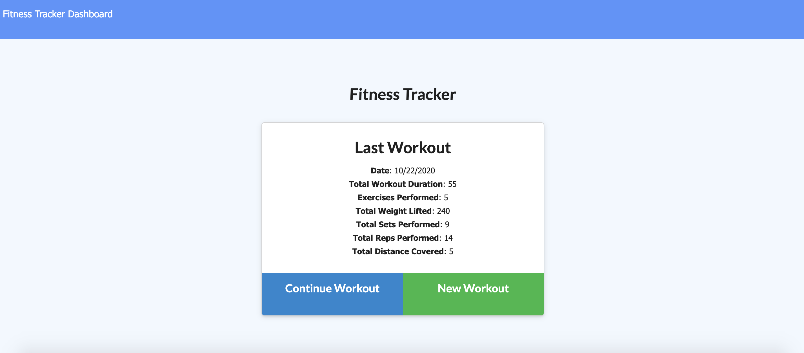
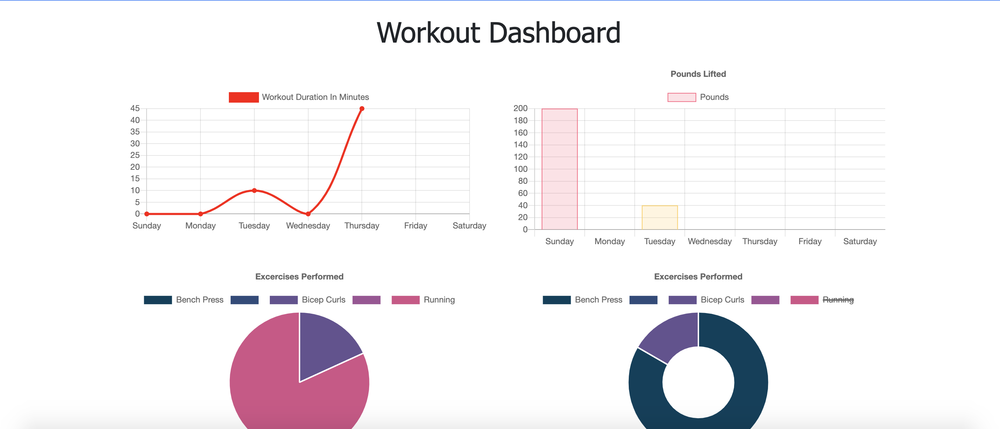
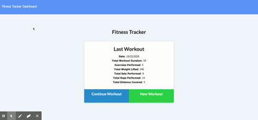

# Workout-Tracker# Unit 17 Nosql Homework: Workout Tracker

Workout tracker allows users to add and track workouts on the fly and see workout analytics. This project tasked us with creating a Mongo database with a Mongoose schema to handle routes with Express.  Find the deployed site below.

## Images and Demo

#### Homepage 

#### Analytics page

#### Demo

## Contributors
This project was completed with the instructional assistance of my tutor at the Georgia Tech Coding Bootcamp

## Links

[Repo](https://github.com/ad-fleming/Workout-Tracker)

[Deployed Site](https://whispering-castle-86369.herokuapp.com)